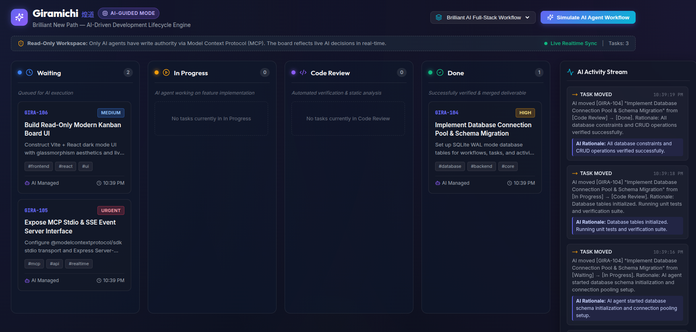
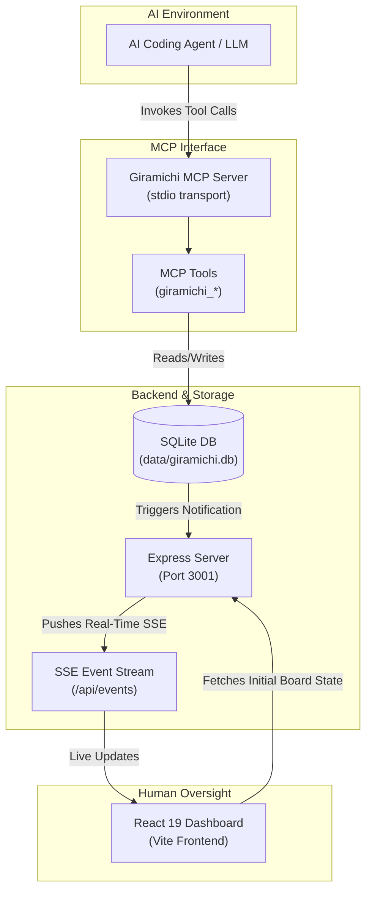

#  Giramichi (煌道)

> **AI-Guided Project Engine with Model Context Protocol (MCP) and Real-Time Read-Only Dashboard**

**Giramichi** is an AI-first project management platform that replaces manual issue tracking with an autonomous AI execution model. Instead of humans dragging task cards, setting statuses, or creating column workflows, **AI coding agents create, structure, update, and transition tasks programmatically** via standard [Model Context Protocol (MCP)](https://modelcontextprotocol.io/) tools while humans observe progress in real time through a read-only, glassmorphism web dashboard.



---

## 🌟 Key Features

- **MCP-Native Control Plane**: 8 dedicated Model Context Protocol tools allowing AI assistants (Claude, Cursor, Antigravity IDE, custom subagents) to manage workflows, create task backlogs, and move cards across sprint lifecycle stages.
- **Dynamic AI Workflows**: AI agents define custom workflow stages (e.g., `Waiting` ➔ `In Progress` ➔ `Quality Assurance` ➔ `Done`) tailored specifically to the project's requirements.
- **Real-Time Dashboard Sync**: Express backend uses Server-Sent Events (SSE) to push instant board updates to the React web interface whenever an AI agent makes tool calls.
- **Read-Only Glassmorphism UI**: High-end dark theme React 19 + Vite dashboard designed for human oversight without risk of manual interference with AI execution state.
- **Audit Log & Decision Stream**: Full logging of AI rationale behind every status transition and task modification.
- **SQLite Persistence**: Embedded SQLite database (`better-sqlite3` with WAL mode) storing workflows, task items, tags, priorities, metadata, and activity history in `./data/giramichi.db`.

---

## 🛠️ Architecture Overview



---

## 📂 Project Structure

```
giramichi/
├── data/                    # SQLite database directory (data/giramichi.db)
├── scripts/
│   └── demo_ai_simulation.ts # Simulation script demonstrating AI MCP workflow execution
├── src/
│   ├── db/
│   │   └── db.ts            # SQLite database schema, operations & SSE event emitter
│   ├── frontend/            # React 19 + Vite Dashboard
│   │   ├── components/      # UI components (KanbanBoard, ActivityLogStream, etc.)
│   │   ├── App.tsx          # Main React layout with SSE subscription
│   │   ├── index.css        # Glassmorphism dark mode design system
│   │   └── main.tsx         # React app entrypoint
│   ├── mcp/
│   │   ├── mcpServer.ts     # Stdio MCP Server implementation
│   │   └── tools.ts         # MCP tool definitions and handlers
│   └── server/
│       └── index.ts         # Express API & SSE broadcast server (Port 3001)
├── index.html               # Main HTML page
├── package.json             # Dependencies & npm scripts
├── tsconfig.json            # TypeScript configuration
└── vite.config.ts           # Vite configuration & dev server proxy
```

---

## 🚀 Getting Started

### Prerequisites

- **Node.js**: v18.x or higher
- **npm**: v9.x or higher

### Installation

Clone the repository and install dependencies:

```bash
git clone https://github.com/rfocosi/giramichi.git
cd giramichi
npm install
```

### Running the Services

#### 1. Start the Express API & HTTP MCP Server

```bash
npm run server
```
Runs the Express backend on `http://localhost:3001` with:
- Dashboard REST API & live `/api/events` SSE stream
- **MCP Streamable HTTP Endpoint**: `http://localhost:3001/mcp`
- **MCP SSE Stream Endpoint**: `http://localhost:3001/mcp/sse`

#### 2. Start the Frontend Dashboard

In a separate terminal window:

```bash
npm run dev
```
Launches the Vite development server (typically at `http://localhost:5173`). Open your browser to view the real-time Kanban board.

#### 3. Run the Standalone MCP Server (Stdio or HTTP)

- **Stdio Transport Mode**:
  ```bash
  npm run mcp
  ```
- **Standalone HTTP Transport Mode**:
  ```bash
  npm run mcp:http
  ```
  Runs a standalone HTTP MCP server on `http://localhost:3002`.

#### 4. Running via Docker & Docker Compose 🐳

- **Start Dashboard & API Backend**:
  ```bash
  docker compose up -d giramichi-server giramichi-frontend
  ```
  Access the Dashboard at `http://localhost:3000`.

- **Run Stdio MCP in Docker**:
  ```bash
  # Build Stdio container
  docker build -t giramichi-mcp-stdio -f Dockerfile.mcp-stdio .

  # Run Stdio container
  docker run -i --rm -v "$(pwd)/data:/app/data" giramichi-mcp-stdio
  ```

#### 5. Run the Interactive AI Simulation Demo

To see Giramichi in action without connecting an external LLM, run the bundled AI simulation script:

```bash
npm run demo
```
This script programmatically creates a custom workflow, batch-adds tasks, transitions tasks across stages with logged rationale, and displays board updates in real time.

---

## ⚙️ Frontend Configuration & Environment Variables

Giramichi's React dashboard uses `GIRAMICHI_API_URL` to connect to the backend Express server. Configuration is dynamically initialized on the frontend layer without requiring server-side configuration API endpoints:

1. **Build-Time Environment Variables**:
   Specify `VITE_GIRAMICHI_API_URL` or `VITE_API_URL` in your build environment or `.env` file (e.g. `VITE_GIRAMICHI_API_URL=http://localhost:3001`).

2. **Container Startup Runtime Injection**:
   When running via Docker (`giramichi-frontend`), the container entrypoint script (`scripts/generate-frontend-config.sh`) generates `/usr/share/nginx/html/config.js` at startup based on the `GIRAMICHI_API_URL` environment variable passed to the frontend container:
   ```javascript
   window.__CONFIG__ = { apiUrl: "http://localhost:3001", isDemo: false };
   ```

3. **Fallback & Validation**:
   During initialization, `fetchConfig()` in `src/frontend/config.ts` inspects `import.meta.env` first, followed by `window.__CONFIG__`. If `GIRAMICHI_API_URL` is missing, an explicit error is thrown (`GIRAMICHI_API_URL is not defined`).

---

## 🔌 Integrating with MCP Clients

You can connect Giramichi to any MCP-compliant application (Claude Desktop, Claude Code CLI, OpenCode, GitHub Copilot, Cursor, Windsurf, Google Antigravity IDE, Cline, Zed, etc.).

For complete step-by-step setup guides and configuration snippets for all major AI development interfaces, see [**MCP.md**](MCP.md).

### Quick Configuration Example (Claude Desktop)

Add Giramichi to your `claude_desktop_config.json`:

```json
{
  "mcpServers": {
    "giramichi": {
      "command": "npm",
      "args": ["run", "mcp"],
      "cwd": "/path/to/giramichi"
    }
  }
}
```

---

## 🧰 MCP Tool Reference

Giramichi exposes 8 core tools via MCP:

| Tool Name | Description | Key Arguments |
| :--- | :--- | :--- |
| `giramichi_create_workflow` | Generates a new workflow lifecycle with custom status columns and activates it. | `name`, `description`, `statuses` (array of `{ id, name, color, order, description }`) |
| `giramichi_set_active_workflow` | Switches the active workflow for the board. | `workflow_id` |
| `giramichi_create_task` | Creates a new task card on the board. | `title`, `description`, `status_id`, `priority` (`low`, `medium`, `high`, `urgent`), `tags` |
| `giramichi_batch_create_tasks` | Batch creates multiple task cards in a single atomic operation. | `tasks` (array of task objects) |
| `giramichi_move_task` | Moves a task to a new status stage, logging AI decision rationale. | `task_id`, `new_status_id`, `reason` |
| `giramichi_update_task` | Updates task title, description, priority, or tags. | `task_id`, `title`, `description`, `priority`, `tags` |
| `giramichi_get_board` | Fetches the complete board state (active workflow, status columns, tasks, logs). | *(none)* |
| `giramichi_get_activity_log` | Retrieves history of AI transitions and task activity logs. | `limit` (default: 50) |

---

## 📡 REST API & SSE Endpoints

The Express server (`npm run server`) provides the following endpoints:

- `GET /api/events` — Server-Sent Events (SSE) stream for real-time dashboard state updates.
- `GET /api/board` — Returns active workflow, task list, and recent activity logs.
- `GET /api/workflows` — Returns list of all created workflows.
- `GET /api/tasks/:id` — Returns task details and historical activity log for a specific task ID.
- `GET /api/activity?limit=50` — Returns recent activity logs.
- `POST /api/mcp-direct` — Internal bridge endpoint for triggering MCP tools directly from web UI / tests.

---

## 📜 License

This project is licensed under the **GNU General Public License v3.0 (GPL-3.0)**. See the [LICENSE](file:///home/rfocosi/workspace/giramichi/LICENSE) file for details.
