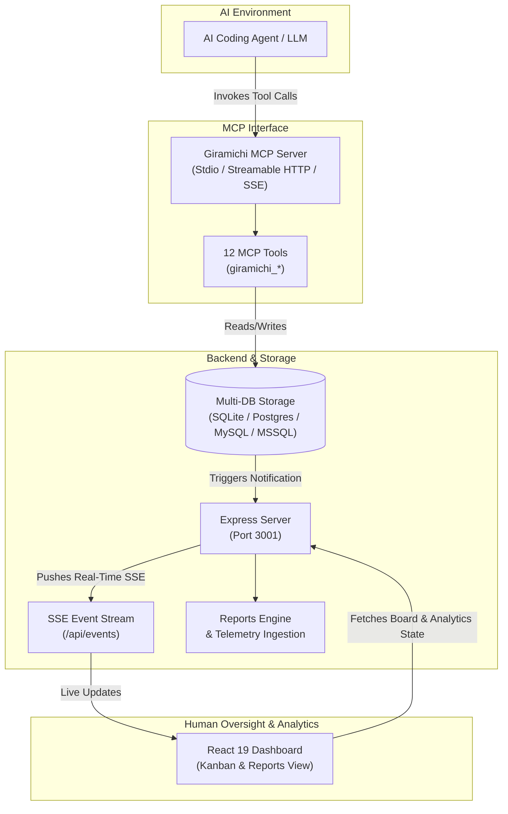

#  Giramichi (煌道)

> **AI-Guided Project Engine with Model Context Protocol (MCP) and Real-Time Read-Only Dashboard**

**Giramichi** is an AI-first project management platform that replaces manual issue tracking with an autonomous AI execution model. Instead of humans dragging task cards, setting statuses, or creating column workflows, **AI coding agents create, structure, update, and transition tasks programmatically** via standard [Model Context Protocol (MCP)](https://modelcontextprotocol.io/) tools while humans observe progress in real time through a read-only, glassmorphism web dashboard.


## 🌟 Key Features

- **MCP-Native Control Plane**: 12 dedicated Model Context Protocol tools allowing AI assistants (Claude, Cursor, Antigravity IDE, custom subagents) to manage sessions, workflows, task backlogs, decimal execution orders, and card transitions.
- **Multi-Agent Session Isolation**: Group tasks, transitions, and metrics by discrete agent sessions (e.g. per-feature, per-agent, or sprint) with seamless session switching.
- **Dynamic AI Workflows**: AI agents define custom workflow stages (e.g., `Waiting` ➔ `In Progress` ➔ `Quality Assurance` ➔ `Done`) tailored specifically to project requirements.
- **Real-Time Dashboard Sync**: Express backend uses Server-Sent Events (SSE) to push instant board updates to the React web interface whenever an AI agent makes tool calls.
- **Executive Analytics & Reports**: Live KPI Ribbon (total tokens, LLM cost estimation, sprint velocity, stage dwell duration, model distribution, and AI retrospective summaries).
- **Read-Only Glassmorphism UI**: High-end dark theme React 19 + Vite dashboard designed for human oversight without risk of manual interference with AI execution state.
- **Pluggable Database Adapters**: Embedded SQLite with WAL mode by default, with built-in production adapters for PostgreSQL, MySQL, and Microsoft SQL Server.
- **Audit Log & Decision Stream**: Full logging of AI rationale behind every status transition and task modification.

---

## 🛠️ Architecture Overview



---

## 📂 Project Structure

```
giramichi/
├── data/                    # SQLite database directory (data/giramichi.db)
├── docs/                    # Screenshots, logo assets, and architectural documents
├── scripts/                 # Simulation and helper scripts
├── src/
│   ├── auth/                # Optional JWT / Keycloak authentication middleware
│   ├── db/                  # Database abstraction layer
│   │   ├── adapters/        # SQLite, PostgreSQL, MySQL, MSSQL database adapters
│   │   ├── db.ts            # Database interface re-exports
│   │   └── types.ts         # TypeScript schema definitions
│   ├── frontend/            # React 19 + Vite Dashboard
│   │   ├── assets/          # Static frontend assets (giramichi.png)
│   │   ├── components/      # UI components (KanbanBoard, ReportsView, WorkflowHeader, etc.)
│   │   ├── App.tsx          # Main React layout with SSE subscription & tab routing
│   │   ├── config.ts        # Dynamic frontend API configuration
│   │   └── index.css        # Glassmorphism dark mode design system
│   ├── mcp/
│   │   ├── httpMcpServer.ts # Streamable HTTP & SSE MCP protocol endpoints
│   │   ├── mcpServer.ts     # Stdio MCP Server implementation
│   │   └── tools.ts         # 12 MCP tool definitions and handlers
│   ├── server/
│   │   ├── index.ts         # Express API & SSE broadcast server (Port 3001)
│   │   ├── reportsEngine.ts # Analytics calculation and aggregation engine
│   │   └── telemetryAutoIngestion.ts # Auto-infer and normalize LLM token metrics
│   └── utils/               # Timeframe and formatting utilities
├── index.html               # Main HTML page
├── package.json             # Dependencies & npm scripts
├── tsconfig.json            # TypeScript configuration
└── vite.config.ts           # Vite configuration & dev server proxy
```

---

## 🚀 Getting Started

### Prerequisites

- **Node.js**: v18.x or higher
- **npm**: v9.x or higher

### Installation

Clone the repository and install dependencies:

```bash
git clone https://github.com/rfocosi/giramichi.git
cd giramichi
npm install
```

### Running the Services

#### 1. Start the Express API & HTTP MCP Server

```bash
npm run server
```
Runs the Express backend on `http://localhost:3001` with:
- Dashboard REST API & live `/api/events` SSE stream
- **MCP Streamable HTTP Endpoint**: `http://localhost:3001/mcp`
- **MCP SSE Stream Endpoint**: `http://localhost:3001/mcp/sse`

#### 2. Start the Frontend Dashboard

In a separate terminal window:

```bash
npm run dev
```
Launches the Vite development server (typically at `http://localhost:5173`). Open your browser to view the real-time Kanban board.

#### 3. Run the Standalone MCP Server (Stdio or HTTP)

- **Stdio Transport Mode**:
  ```bash
  npm run mcp
  ```
- **Standalone HTTP Transport Mode**:
  ```bash
  npm run mcp:http
  ```
  Runs a standalone HTTP MCP server on `http://localhost:3002`.

#### 4. Running via Docker & Docker Compose 🐳

- **Start Dashboard & API Backend**:
  ```bash
  docker compose up -d giramichi-server giramichi-frontend
  ```
  Access the Dashboard at `http://localhost:3000`.

- **Run Stdio MCP in Docker**:
  ```bash
  # Build Stdio container
  docker build -t giramichi-mcp-stdio -f Dockerfile.mcp-stdio .

  # Run Stdio container
  docker run -i --rm -v "$(pwd)/data:/app/data" giramichi-mcp-stdio
  ```

#### 5. Run the Interactive AI Simulation Demo

To see Giramichi in action without connecting an external LLM, run the bundled AI simulation script:

```bash
npm run demo
```
This script programmatically creates a custom workflow, batch-adds tasks, transitions tasks across stages with logged rationale, and displays board updates in real time.

---

## ⚙️ Environment Configuration & Variables

Giramichi is configured via `.env` (see [.env.example](.env.example)):

### Core Backend & Database Variables

| Variable | Default | Description |
| :--- | :--- | :--- |
| `PORT` | `3001` | Express API and SSE stream port. |
| `DB_TYPE` | `sqlite` | Database engine (`sqlite`, `postgres`, `mysql`, `mssql`). |
| `DB_DIR` / `DB_FILE` | `data` / `giramichi.db` | SQLite storage directory and filename. |
| `DATABASE_URL` | *(none)* | Connection URI for PostgreSQL, MySQL, or MSSQL. |
| `GIRAMICHI_SESSION_HISTORY_DISPLAY_PERIOD` | `3D` | Active session filter window based on `updated_at`. Supports `H` (hours), `D` (days), `W` (weeks), `Y` (years), or `all`. |
| `AUTH_MODE` | `disabled` | Authentication mode (`disabled` or `oauth2`). |
| `OAUTH2_ISSUER` / `OAUTH2_JWKS_URI` | *(none)* | Keycloak / OIDC identity provider issuer and JWKS URI. |

### Frontend Dashboard Configuration

Giramichi's React dashboard uses `GIRAMICHI_API_URL` to connect to the backend Express server:

1. **Build-Time Environment Variables**:
   Specify `VITE_GIRAMICHI_API_URL` or `VITE_API_URL` in your build environment or `.env` file (e.g. `VITE_GIRAMICHI_API_URL=http://localhost:3001`).

2. **Container Startup Runtime Injection**:
   When running via Docker (`giramichi-frontend`), the container entrypoint script (`scripts/generate-frontend-config.sh`) generates `/usr/share/nginx/html/config.js` at startup based on the `GIRAMICHI_API_URL` environment variable passed to the frontend container:
   ```javascript
   window.__CONFIG__ = { apiUrl: "http://localhost:3001", isDemo: false };
   ```

3. **Fallback & Validation**:
   During initialization, `fetchConfig()` in `src/frontend/config.ts` inspects `import.meta.env` first, followed by `window.__CONFIG__`. If `GIRAMICHI_API_URL` is missing, an explicit error is thrown (`GIRAMICHI_API_URL is not defined`).

---

## 🔌 Integrating with MCP Clients

You can connect Giramichi to any MCP-compliant application (Claude Desktop, Claude Code CLI, OpenCode, GitHub Copilot, Cursor, Windsurf, Google Antigravity IDE, Cline, Zed, etc.).

For complete step-by-step setup guides and configuration snippets for all major AI development interfaces, see [**MCP.md**](docs/MCP.md).

### Quick Configuration Example (Claude Desktop)

Add Giramichi to your `claude_desktop_config.json`:

```json
{
  "mcpServers": {
    "giramichi": {
      "command": "npm",
      "args": ["run", "mcp"],
      "cwd": "/path/to/giramichi"
    }
  }
}
```

---

## 🧰 MCP Tool Reference

Giramichi exposes 12 native Model Context Protocol (MCP) tools:

| Tool Name | Description | Key Arguments |
| :--- | :--- | :--- |
| `giramichi_create_session` | Creates a new agent execution session for organizing tasks and metrics. | `name`, `description`, `agent_id`, `workflow_id` |
| `giramichi_list_sessions` | Lists active, completed, or archived agent sessions. | `status` (`active`, `completed`, `archived`) |
| `giramichi_get_session` | Retrieves details, task breakdown, next task to implement, and logs for a session. | `session_id` |
| `giramichi_close_session` | Closes or archives an execution session. | `session_id`, `status` (`completed`, `archived`) |
| `giramichi_create_workflow` | Generates a new workflow lifecycle with custom status columns and activates it. | `name`, `description`, `statuses` (array of `{ id, name, color, order, description }`) |
| `giramichi_set_active_workflow` | Switches the active workflow for the board. | `workflow_id` |
| `giramichi_create_task` | Creates a new task card on the board with decimal ordering and session grouping. | `title`, `description`, `status_id`, `priority`, `order`, `tags`, `session_id`, `metrics` |
| `giramichi_batch_create_tasks` | Batch creates multiple task cards in a single atomic operation. | `tasks` (array of task objects), `session_id` |
| `giramichi_move_task` | Moves a task to a new status stage, logging AI decision rationale and telemetry. | `task_id`, `new_status_id`, `reason`, `metrics` |
| `giramichi_update_task` | Updates task title, description, priority, order position, tags, or metrics. | `task_id`, `title`, `description`, `priority`, `order`, `tags`, `metrics` |
| `giramichi_get_board` | Fetches complete board state (active workflow, columns, tasks, logs, next task). | `session_id` (optional filter, default: active session) |
| `giramichi_get_activity_log` | Retrieves history of AI transitions and task activity logs. | `limit` (default: 50), `session_id` |

---

## 📡 REST API & SSE Endpoints

The Express server (`npm run server`) provides the following endpoints:

- `GET /api/events` — Server-Sent Events (SSE) stream for real-time dashboard state updates.
- `GET /api/board?session_id=...` — Returns active workflow, sessions list, filtered tasks, and recent activity logs.
- `GET /api/sessions` — Lists all agent sessions with active session status.
- `GET /api/sessions/:id` — Returns details, tasks, and activity history for a specific session ID.
- `GET /api/workflows` — Returns list of all created workflows.
- `GET /api/tasks/:id` — Returns task details and historical activity log for a specific task ID.
- `GET /api/activity?limit=50&session_id=...` — Returns recent activity logs.
- `GET /api/reports?session_id=...&timeframe=...` — Returns calculated metrics (KPI ribbon, stage dwell duration, model distribution, sprint retro data).
- `POST /api/mcp-direct` — Internal bridge endpoint for triggering MCP tools directly from web UI / tests.

---

## 📜 License

This project is licensed under the **GNU General Public License v3.0 (GPL-3.0)**. See the [LICENSE](file:///home/rfocosi/workspace/giramichi/LICENSE) file for details.
